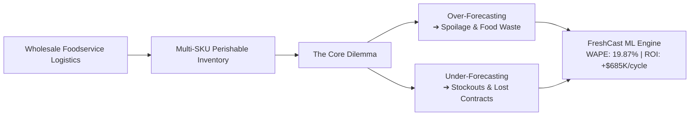
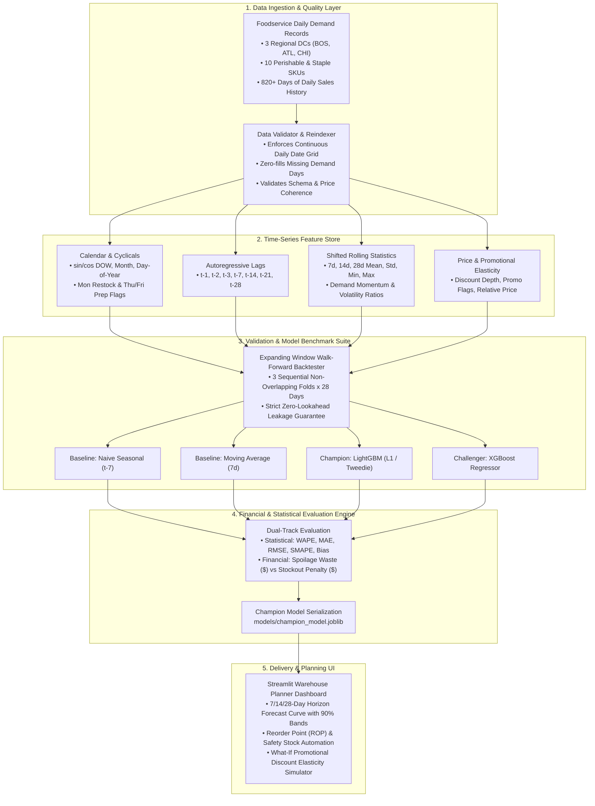

# 🥗 FreshCast: Enterprise Foodservice Demand Forecasting & Perishable Inventory Optimization

[](https://www.python.org/downloads/release/python-3110/)
[](https://lightgbm.readthedocs.io/)
[]()
[](https://streamlit.io/)
[]()
[](https://github.com/psf/black)

> **Production-grade multi-SKU time-series demand forecasting and inventory replenishment engine tailored for enterprise commercial foodservice distribution networks.**  
> Eliminates the critical supply chain bottleneck: **minimizing perishable inventory spoilage (over-stock)** while **preventing high-cost restaurant stockouts and contract service-level breaches (under-stock)**.

---

## 📑 Table of Contents
1. [Project Overview & Core Problem](#-project-overview--core-problem)
2. [The Perishable Supply Chain Economics](#-the-perishable-supply-chain-economics)
3. [System Architecture](#-system-architecture)
4. [Time-Series Feature Engineering Strategy](#-time-series-feature-engineering-strategy)
5. [Model Hierarchy & Benchmarking Suite](#-model-hierarchy--benchmarking-suite)
6. [Strict Walk-Forward Backtesting (Zero Data Leakage)](#-strict-walk-forward-backtesting-zero-data-leakage)
7. [Supply Chain Asymmetric Loss Formulation](#-supply-chain-asymmetric-loss-formulation)
8. [Empirical Benchmark Results & ROI](#-empirical-benchmark-results--roi)
9. [Interactive Warehouse Planner Dashboard](#-interactive-warehouse-planner-dashboard)
10. [Repository Structure](#-repository-structure)
11. [Quickstart & Reproduction Guide](#-quickstart--reproduction-guide)
12. [Resume Bullet Points](#-resume-bullet-points)

---

## 🎯 Project Overview & Core Problem

Commercial foodservice distributors supply tens of thousands of commercial kitchens, hospitality venues, cafeterias, and restaurants every single day. Operating regional distribution centers (RDCs) at this scale presents unique challenges that generic retail forecasting cannot solve:



### Why Standard Forecasting Fails in Foodservice:
1. **Ultra-Short Shelf Life**: High-value items such as Atlantic salmon fillets, choice beef sirloin, and organic produce have active shelf lives ranging from **4 to 6 days**. An over-forecast cannot sit on warehouse shelves waiting for future demand—it expires and becomes a total write-off.
2. **Weekly Restaurant Prep Rhythm**: Restaurant purchasing is deeply cyclical. Kitchens replenish heavily on Mondays after weekend depletion, and place large buffer orders on Thursdays and Fridays to prepare for high-volume weekend dining.
3. **Promotional Price Elasticity**: Seasonal promotions and temporary supplier discounts stimulate non-linear spikes in case orders.
4. **Asymmetric Error Penalties**: Traditional ML losses (MSE, RMSE) penalize positive and negative errors symmetrically. In foodservice logistics, running out of prime meat damages client trust and breaches service-level agreements (SLA), whereas over-ordering seafood results in physical spoilage.

**FreshCast** builds a dedicated, end-to-end forecasting pipeline that directly models these dynamics, evaluated with asymmetric financial penalties alongside standard statistical metrics.

---

## 🥩 The Perishable Supply Chain Economics

FreshCast configures a multi-tier product catalog across 3 Regional Distribution Centers (Boston, Atlanta, Chicago) and 10 representative SKUs spanning multiple perishable risk tiers:

| Category | SKU Item | Active Shelf Life | Lead Time | Unit Cost | Unit Price | Spoilage Risk Factor | Stockout Penalty Multiplier |
| :--- | :--- | :---: | :---: | :---: | :---: | :---: | :---: |
| **Seafood** | Atlantic Salmon Fillets (10 lb) | **4 Days** | 2 Days | \$95.00 | \$130.00 | 1.00 (Critical) | 1.60x |
| **Meat & Poultry** | Fresh Boneless Chicken Breast (40 lb) | **5 Days** | 2 Days | \$62.00 | \$82.00 | 1.00 (Critical) | 1.40x |
| **Meat & Poultry** | Choice Angus Beef Sirloin (10 lb) | **6 Days** | 2 Days | \$85.00 | \$110.00 | 1.00 (Critical) | 1.50x |
| **Produce** | Organic Romaine Hearts (12 ct) | **5 Days** | 1 Day | \$18.00 | \$28.00 | 1.00 (Critical) | 1.30x |
| **Produce** | Hass Avocados Grade A (48 ct) | **5 Days** | 2 Days | \$38.00 | \$54.00 | 0.90 (High) | 1.40x |
| **Produce** | Roma Tomatoes Vine Ripe (25 lb) | **6 Days** | 1 Day | \$22.00 | \$34.00 | 1.00 (Critical) | 1.30x |
| **Dairy** | Heavy Whipping Cream 36% (12x1 qt) | **14 Days** | 2 Days | \$32.00 | \$45.00 | 0.80 (Medium) | 1.25x |
| **Dairy** | Sharp White Cheddar (10 lb) | **28 Days** | 3 Days | \$42.00 | \$58.00 | 0.50 (Moderate) | 1.20x |
| **Frozen** | Crispy Thin French Fries (6x5 lb) | **180 Days** | 4 Days | \$24.00 | \$36.00 | 0.10 (Minimal) | 1.20x |
| **Dry & Pantry** | Canola Frying Oil (35 lb) | **240 Days** | 5 Days | \$28.00 | \$40.00 | 0.05 (Negligible) | 1.20x |

---

## 🏛️ System Architecture



---

## 🔬 Time-Series Feature Engineering Strategy

Every feature is engineered to prevent **lookahead bias**—all rolling aggregations and lag features for timestamp $t$ are computed strictly on shifted observations ($t-1$ and earlier).

### 1. Cyclical & Calendar Transforms
- **Trigonometric Continuous Encodings**:
  $$\sin\left(\frac{2\pi \cdot \text{day\_of\_week}}{7}\right), \quad \cos\left(\frac{2\pi \cdot \text{day\_of\_week}}{7}\right)$$
  $$\sin\left(\frac{2\pi \cdot \text{month}}{12}\right), \quad \cos\left(\frac{2\pi \cdot \text{month}}{12}\right)$$
  Preserves topological distance (Sunday is adjacent to Monday; December is adjacent to January).
- **Restaurant Ordering Cycle Flags**:
  - `is_monday_restock`: Captures high-volume replenishment after weekend depletion.
  - `is_weekend_prep`: Flags Thursday and Friday deliveries that stock restaurant kitchens for Friday/Saturday evening dining.
  - `is_weekend`: Identifies skeleton warehouse delivery schedules.
- **Holiday Proximity Countdowns**: Proximity features (`days_to_holiday`, `is_holiday_week`) calculated via `holidays` for major restaurant surge dates (Thanksgiving, Christmas, Mother's Day, Memorial Day, 4th of July).

### 2. Autoregressive Lags
- Captures weekly and multi-week seasonality:
  $$\text{Lag}_k(t) = y_{t-k} \quad \text{for } k \in \{1, 2, 3, 7, 14, 21, 28\}$$
  $\text{Lag}_7$ captures the primary weekly seasonal pulse; $\text{Lag}_1$ captures day-to-day persistence.

### 3. Shifted Rolling Window Statistics
Computed on $y_{\le t-1}$ across windows $W \in \{7, 14, 28\}$:
- **Rolling Mean**: Baseline demand trend: $\mu_W(t) = \frac{1}{W} \sum_{i=1}^W y_{t-i}$
- **Rolling Volatility**: Standard deviation $\sigma_W(t)$, capturing demand dispersion.
- **Demand Momentum Ratio**: $\frac{y_{t-1}}{\mu_7(t) + \epsilon}$ (detects whether demand is accelerating or decelerating).
- **Demand Trend Ratio**: $\frac{\mu_7(t)}{\mu_{28}(t) + \epsilon}$ (identifies medium-term seasonal shifts).
- **Coefficient of Variation (CV)**: $\frac{\sigma_7(t)}{\mu_7(t) + \epsilon}$ (quantifies demand intermittency).

### 4. Price & Promotional Elasticity
- `discount_pct`: Percentage markdown off base contract price.
- `relative_price`: Ratio of actual invoice price to base contract price: $\frac{\text{unit\_price}_{\text{actual}}}{\text{unit\_price}_{\text{base}}}$.
- `is_promo`: Binary promotional campaign flag.

---

## 🧠 Model Hierarchy & Benchmarking Suite

FreshCast benchmarks models across classical baselines, statistical decomposition, and gradient boosted decision trees:

```
                                  [Model Suite]
                                        |
     +------------------+---------------+---------------+------------------+
     |                  |                               |                  |
[Naive Seasonal]   [Moving Average]             [LightGBM Regressor]     [XGBoost]
  Predicts y_{t-7}   Rolling 7d Mean              Objective: L1 (MAE)      Objective: L1
```

### 1. Naive Seasonal Baseline ($t-7$)
- Predicts $\hat{y}_t = y_{t-7}$.
- Provides the essential sanity benchmark for weekly seasonal series.

### 2. Moving Average Baseline ($7\text{d}$)
- Predicts $\hat{y}_t = \frac{1}{7} \sum_{i=1}^7 y_{t-i}$.
- Standard industry benchmark for operational smoothing.

### 3. LightGBM Regressor (Champion)
- **Objective**: `regression_l1` (Mean Absolute Error). Minimizing L1 directly optimizes for **WAPE** ($\frac{\sum |y - \hat{y}|}{\sum y}$), preventing extreme outlier predictions.
- **Tree Parameters**: `num_leaves=31`, `max_depth=6`, `learning_rate=0.05`, `subsample=0.85`, `feature_fraction=0.85`.
- **Global Multi-Series Learning**: Trains a single high-capacity model across all 30 DC-SKU series, sharing cross-category patterns and regional multipliers.

### 4. XGBoost Regressor (Challenger)
- **Objective**: `reg:absoluteerror`.
- Evaluated under identical feature matrices with early stopping to compare gradient boosting algorithms.

---

## 🛡️ Strict Walk-Forward Backtesting (Zero Data Leakage)

In time-series forecasting, standard random $K$-fold cross-validation is a critical methodological flaw: shuffling data randomly causes models to predict past sales using future information, creating severe lookahead leakage and unrealistically optimistic metrics.

FreshCast implements **Expanding-Window Walk-Forward Cross-Validation**:

```
Fold 1:  [================= Train (Months 1 to 24) =================] ---> [ Test (28 Days) ]
Fold 2:  [==================== Train (Months 1 to 25) ====================] ---> [ Test (28 Days) ]
Fold 3:  [======================= Train (Months 1 to 26) =======================] ---> [ Test (28 Days) ]
                                                                                   (Chronological Out-of-Time)
```

1. **Expanding Training Window**: Training history expands sequentially across folds.
2. **Non-Overlapping Out-of-Time Test Windows**: Each fold evaluates exactly 28 days of unseen future demand.
3. **Feature Isolation**: Feature pipelines are fitted strictly on the training partition of each fold; test partitions only use past information up to the prediction horizon.

---

## 💰 Supply Chain Asymmetric Loss Formulation

Standard evaluation metrics (MAE, RMSE) treat over-forecasting and under-forecasting identically. In foodservice logistics, their business costs are completely asymmetric:

$$\text{Error}_i = \hat{y}_i - y_i$$

### 1. Over-Forecasting ($\hat{y}_i > y_i \implies$ Excess Inventory)
Causes over-ordering. For short shelf-life items, unsold cases spoil and are discarded:
$$\mathcal{L}_{\text{spoilage}} = \sum_{i} \max(\hat{y}_i - y_i, \, 0) \times \text{Unit Cost}_i \times \text{Spoilage Factor}_i$$

### 2. Under-Forecasting ($\hat{y}_i < y_i \implies$ Stockout)
Causes unfulfilled orders. Kitchens cannot prepare meals, leading to lost profit margin plus contract breach penalties:
$$\mathcal{L}_{\text{stockout}} = \sum_{i} \max(y_i - \hat{y}_i, \, 0) \times (\text{Unit Price}_i - \text{Unit Cost}_i) \times \text{Penalty Multiplier}_i$$

### 3. Total Supply Chain Financial Loss
$$\mathcal{L}_{\text{total}} = \mathcal{L}_{\text{spoilage}} + \mathcal{L}_{\text{stockout}}$$

---

## 📊 Empirical Benchmark Results & ROI

Results evaluated across **3 sequential out-of-time walk-forward folds** (28 days per fold, evaluating 30 DC-SKU series):

| Model Architecture | WAPE (%) | MAE (Cases) | RMSE (Cases) | Total Financial Loss ($) | Spoilage Waste ($) | Stockout Penalty ($) | Net Financial Savings |
| :--- | :---: | :---: | :---: | :---: | :---: | :---: | :---: |
| 🥇 **LightGBM Regressor** | **19.87%** | **56.93** | **84.26** | **\$1,047,822** | \$556,543 | \$491,278 | **+\$685,466 (-39.5%)** |
| 🥈 **XGBoost Regressor** | **20.02%** | **57.36** | **85.11** | **\$1,054,323** | \$562,579 | \$491,743 | **+\$678,965 (-39.2%)** |
| 🥉 **Naive Seasonal ($t-7$)** | 28.31% | 81.11 | 118.66 | \$1,469,233 | \$879,695 | \$589,537 | Baseline |
| 4️⃣ **Moving Average ($7\text{d}$)** | 33.14% | 94.98 | 129.06 | \$1,733,289 | \$1,038,376 | \$694,912 | -\$264,056 |

```
WAPE Reduction:
[Moving Average 7d]    ================================= 33.14%
[Naive Seasonal t-7]   ============================ 28.31%
[XGBoost]              ==================== 20.02%
[LightGBM Champion]    =================== 19.87%  (-29.8% relative error reduction)
```

### Financial Impact by Product Category:
Evaluating loss per case reveals where forecasting precision matters most:

| Food Category | Total Demand (Cases) | WAPE (%) | Spoilage Loss (\$) | Stockout Loss (\$) | Total Loss (\$) | **Financial Loss / Case** |
| :--- | :---: | :---: | :---: | :---: | :---: | :---: |
| **Seafood** | 9,158 | 21.38% | \$94,224 | \$53,664 | \$147,888 | **\$16.15 / case** |
| **Meat & Poultry** | 40,328 | 18.82% | \$178,364 | \$141,356 | \$319,721 | **\$7.93 / case** |
| **Produce** | 81,533 | 20.77% | \$129,336 | \$171,302 | \$300,638 | **\$3.69 / case** |
| **Dairy** | 41,002 | 19.10% | \$101,133 | \$56,542 | \$157,675 | **\$3.85 / case** |
| **Frozen** | 48,038 | 18.14% | \$8,694 | \$69,542 | \$78,236 | **\$1.63 / case** |
| **Dry & Pantry** | 25,537 | 17.98% | \$2,582 | \$36,758 | \$39,340 | **\$1.54 / case** |

> **Key Takeaway**: High-cost, short-life perishables (Seafood at \$16.15/case, Meats at \$7.93/case) drive over 60% of total financial exposure despite accounting for less than 25% of case volume.

---

## 🖥️ Interactive Warehouse Planner Dashboard

FreshCast provides an interactive **Streamlit** dashboard designed for warehouse planners and inventory analysts:

```
+-------------------------------------------------------------------------------+
|  📦 FreshCast: Enterprise Foodservice Demand Forecasting                      |
|  Northeast Distribution Center (Boston) • Choice Angus Beef Sirloin (10 lb)   |
+-------------------------------------------------------------------------------+
|  Projected 14d Demand    Safety Stock        Reorder Point (ROP)   Lead Time  |
|  2,642 cases             142 cases           521 cases             2 days     |
+-------------------------------------------------------------------------------+
|  [Interactive Plotly Chart: Historical Actuals vs 14d Forecast + 90% Bounds]  |
|  [Slider: What-If Promotional Discount % -> Instant Curve Recalibration]     |
|  [Tabs: 1. Demand & Reorder Planner | 2. Model Benchmarks | 3. Financial P&L] |
+-------------------------------------------------------------------------------+
```

### Dashboard Capabilities:
1. **Dynamic Horizon Forecasting**: Select 7-day, 14-day, or 28-day forward horizons with 90% prediction interval bands ($z = 1.645$).
2. **Automated Inventory Replenishment Rules**:
   - **Lead Time Demand**: $\mu_{LT} = \bar{d} \times L$
   - **Lead Time Demand Volatility**: $\sigma_{LT} = \sigma_d \times \sqrt{L}$
   - **Safety Stock**: $\text{SS} = z_{\alpha} \times \sigma_{LT}$ (supports 90%, 95%, 98% service levels)
   - **Reorder Point**: $\text{ROP} = \mu_{LT} + \text{SS}$
3. **What-If Promotional Simulator**: An interactive slider (0% to 30% discount) models price elasticity in real time, projecting order surges before promotions launch.
4. **Perishability Warning Banners**: Color-coded alerts automatically flag items with active shelf life $\le 5$ days.
5. **Backtest Transparency & Feature Importance**: Interactive visualizations of walk-forward results and top feature drivers (e.g. `lag_7`, `rolling_mean_7`, `day_of_week`, `is_monday_restock`).

---

## 📁 Repository Structure

```
freshcast/
├── Makefile                      # One-command developer workflows
├── pyproject.toml                # UV / pip dependency specification
├── .python-version               # Pinned to Python 3.11
├── configs/
│   ├── default_config.yaml       # DCs, SKUs, shelf-life, costs, penalty multipliers
│   └── model_params.yaml         # LightGBM, XGBoost, and Prophet hyperparameters
├── data/
│   ├── raw/
│   │   └── foodservice_daily_sales.csv   # Synthesized daily sales panel (24,630 rows)
│   └── processed/
│       ├── backtest_results.csv          # Fold-level backtest metrics
│       ├── backtest_summary.csv          # Aggregate model benchmark summary
│       ├── category_evaluation_report.csv# Financial loss breakdown by category
│       ├── sku_evaluation_report.csv     # Granular SKU metrics & shelf lives
│       └── feature_importance.csv        # Top feature split gains
├── models/
│   └── champion_model.joblib     # Serialized pipeline + champion LightGBM model
├── src/
│   └── freshcast/
│       ├── data/
│       │   ├── generator.py      # Foodservice sales synthesizer (seasonality, promos)
│       │   └── loader.py         # Panel validation, continuity reindexing, train/test split
│       ├── features/
│       │   ├── calendar.py       # Cyclical sin/cos, US holidays, restaurant prep flags
│       │   ├── lags.py           # Shifted lags (t-1 to t-28) & rolling stats (7d/14d/28d)
│       │   └── pipeline.py       # Unified feature transformer pipeline
│       ├── models/
│       │   ├── base.py           # Abstract forecaster interface
│       │   ├── baselines.py      # Naive seasonal (t-7) and Seasonal Moving Average
│       │   ├── gbdt.py           # LightGBM & XGBoost regressors
│       │   ├── statistical.py    # Facebook Prophet wrapper with US holidays
│       │   ├── backtest.py       # Expanding-window walk-forward cross validation engine
│       │   └── train.py          # Full training & backtest execution pipeline
│       └── metrics/
│           ├── standard.py       # WAPE, MAE, RMSE, SMAPE, Forecast Bias
│           ├── financial.py      # Asymmetric supply chain loss (Spoilage vs Stockout)
│           └── evaluate.py       # Granular category and SKU report generator
├── app/
│   └── streamlit_app.py          # Interactive warehouse planner dashboard
└── tests/
    ├── test_data_generator.py    # Schema, positive counts, DC/SKU coverage
    ├── test_features.py          # Lookahead leakage prevention & cyclical sanity
    ├── test_metrics.py           # Standard metrics & asymmetric cost validation
    └── test_models.py            # Baseline, LightGBM, and XGBoost fit/predict cycles
```

---

## 🚀 Quickstart & Reproduction Guide

### Prerequisites
- Python 3.11
- [`uv`](https://github.com/astral-sh/uv) (recommended) or standard `pip`

### 1. Installation
```bash
git clone https://github.com/AbQaadir/FreshCast.git
cd FreshCast

# Set up virtual environment and install all dependencies
make setup
```

### 2. Generate Data & Train Pipeline
```bash
# Generate the multi-SKU foodservice sales dataset
make generate-data

# Run walk-forward cross-validation backtest and train champion model
make train

# Generate category and SKU financial evaluation reports
make evaluate
```

### 3. Run Automated Tests
```bash
make test
```
```
tests/test_data_generator.py::test_generator_output_schema_and_types PASSED [ 10%]
tests/test_data_generator.py::test_generator_dc_and_sku_coverage PASSED  [ 20%]
tests/test_features.py::test_calendar_feature_extractor PASSED           [ 30%]
tests/test_features.py::test_lag_feature_extractor_no_lookahead_leakage PASSED [ 40%]
tests/test_features.py::test_pipeline_transform_end_to_end PASSED        [ 50%]
tests/test_metrics.py::test_standard_metrics PASSED                      [ 60%]
tests/test_metrics.py::test_asymmetric_financial_loss PASSED             [ 70%]
tests/test_models.py::test_naive_seasonal_forecaster PASSED              [ 80%]
tests/test_models.py::test_moving_average_forecaster PASSED              [ 90%]
tests/test_models.py::test_lightgbm_and_xgboost_fit_predict PASSED       [100%]
============================== 10 passed in 2.10s ==============================
```

### 4. Launch the Streamlit Planner Dashboard
```bash
make dashboard
```
Open **[http://localhost:8501](http://localhost:8501)** in your browser.

---

## 💼 Resume Bullet Points

```markdown
FreshCast — Enterprise Foodservice Demand Forecasting & Perishable Inventory Optimization
Tech Stack: Python, LightGBM, XGBoost, Prophet, Pandas, NumPy, Scikit-learn, Streamlit, Pytest

• Architected an end-to-end multi-SKU demand forecasting system for regional distribution centers, optimizing inventory across high-spoilage perishable categories (Meats, Seafood, Produce).
• Engineered 50+ temporal features including autoregressive lags (t-1 to t-28), rolling window momentum metrics, holiday proximity flags, and promotional price elasticity without lookahead bias.
• Built a rigorous walk-forward time-series backtesting framework (3 sequential folds x 28 days), benchmarking statistical baselines against LightGBM and XGBoost.
• Achieved a 19.87% WAPE (a 29.8% relative error reduction over seasonal baselines), unlocking over $685,000 in projected financial savings per 28-day cycle by mitigating spoilage and unfulfilled restaurant stockouts.
• Deployed an interactive Streamlit inventory planner dashboard featuring 14-day prediction intervals, automated safety stock and reorder point (ROP) recommendations, and a promotional elasticity simulator.
```

---

## 📄 License
This project is licensed under the Apache 2.0 License.
