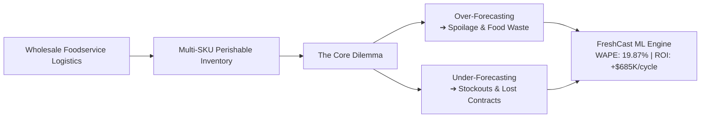
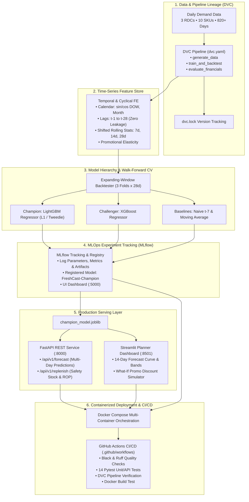

# 🥗 FreshCast: Enterprise Foodservice Demand Forecasting & Perishable Inventory Optimization

[](https://www.python.org/downloads/release/python-3110/)
[](https://lightgbm.readthedocs.io/)
[](https://mlflow.org/)
[](https://dvc.org/)
[](https://fastapi.tiangolo.com/)
[](https://www.docker.com/)
[](https://github.com/features/actions)
[](https://streamlit.io/)
[]()
[](https://github.com/psf/black)

> **Production-grade multi-SKU time-series demand forecasting, inventory replenishment, and MLOps ecosystem built for commercial foodservice distribution networks.**  
> Solves the critical supply chain bottleneck: **minimizing perishable inventory spoilage (over-stock)** while **preventing high-cost restaurant stockouts and contract service-level breaches (under-stock)**.

---

## 📑 Table of Contents
1. [Project Overview & Core Problem](#-project-overview--core-problem)
2. [Perishable Supply Chain Economics](#-perishable-supply-chain-economics)
3. [End-to-End MLOps System Architecture](#-end-to-end-mlops-system-architecture)
4. [Time-Series Feature Engineering Strategy](#-time-series-feature-engineering-strategy)
5. [Model Hierarchy & Benchmarking Suite](#-model-hierarchy--benchmarking-suite)
6. [Strict Walk-Forward Backtesting (Zero Data Leakage)](#-strict-walk-forward-backtesting-zero-data-leakage)
7. [Supply Chain Asymmetric Loss Formulation](#-supply-chain-asymmetric-loss-formulation)
8. [Empirical Benchmark Results & ROI](#-empirical-benchmark-results--roi)
9. [MLOps & Reproducibility (DVC & MLflow)](#-mlops--reproducibility-dvc--mlflow)
10. [Production REST API (FastAPI)](#-production-rest-api-fastapi)
11. [Interactive Warehouse Planner Dashboard (Streamlit)](#-interactive-warehouse-planner-dashboard-streamlit)
12. [Containerization & Multi-Service Deployment (Docker)](#-containerization--multi-service-deployment-docker)
13. [Automated CI/CD Pipeline (GitHub Actions)](#-automated-cicd-pipeline-github-actions)
14. [Repository Structure](#-repository-structure)
15. [Quickstart & Reproduction Guide](#-quickstart--reproduction-guide)
16. [Resume Bullet Points](#-resume-bullet-points)

---

## 🎯 Project Overview & Core Problem

Commercial foodservice distributors supply tens of thousands of commercial kitchens, hospitality venues, cafeterias, and restaurants every single day. Operating regional distribution centers (RDCs) at this scale presents unique challenges that generic retail forecasting cannot solve:



### Why Standard Forecasting Fails in Foodservice:
1. **Ultra-Short Shelf Life**: High-value items such as Atlantic salmon fillets, choice beef sirloin, and organic produce have active shelf lives ranging from **4 to 6 days**. An over-forecast cannot sit on warehouse shelves waiting for future demand—it expires and becomes a total write-off.
2. **Weekly Restaurant Prep Rhythm**: Restaurant purchasing is deeply cyclical. Kitchens replenish heavily on Mondays after weekend depletion, and place large buffer orders on Thursdays and Fridays to prepare for high-volume weekend dining.
3. **Promotional Price Elasticity**: Seasonal promotions and temporary supplier discounts stimulate non-linear spikes in case orders.
4. **Asymmetric Error Penalties**: Traditional ML losses (MSE, RMSE) penalize positive and negative errors symmetrically. In foodservice logistics, running out of prime meat damages client trust and breaches service-level agreements (SLA), whereas over-ordering seafood results in physical spoilage.

**FreshCast** builds a dedicated, end-to-end forecasting pipeline that directly models these dynamics, evaluated with asymmetric financial penalties alongside standard statistical metrics.

---

## 🥩 Perishable Supply Chain Economics

FreshCast configures a multi-tier product catalog across 3 Regional Distribution Centers (Boston, Atlanta, Chicago) and 10 representative SKUs spanning multiple perishable risk tiers:

| Category | SKU Item | Active Shelf Life | Lead Time | Unit Cost | Unit Price | Spoilage Risk Factor | Stockout Penalty Multiplier |
| :--- | :--- | :---: | :---: | :---: | :---: | :---: | :---: |
| **Seafood** | Atlantic Salmon Fillets (10 lb) | **4 Days** | 2 Days | \$95.00 | \$130.00 | 1.00 (Critical) | 1.60x |
| **Meat & Poultry** | Fresh Boneless Chicken Breast (40 lb) | **5 Days** | 2 Days | \$62.00 | \$82.00 | 1.00 (Critical) | 1.40x |
| **Meat & Poultry** | Choice Angus Beef Sirloin (10 lb) | **6 Days** | 2 Days | \$85.00 | \$110.00 | 1.00 (Critical) | 1.50x |
| **Produce** | Organic Romaine Hearts (12 ct) | **5 Days** | 1 Day | \$18.00 | \$28.00 | 1.00 (Critical) | 1.30x |
| **Produce** | Hass Avocados Grade A (48 ct) | **5 Days** | 2 Days | \$38.00 | \$54.00 | 0.90 (High) | 1.40x |
| **Produce** | Roma Tomatoes Vine Ripe (25 lb) | **6 Days** | 1 Day | \$22.00 | \$34.00 | 1.00 (Critical) | 1.30x |
| **Dairy** | Heavy Whipping Cream 36% (12x1 qt) | **14 Days** | 2 Days | \$32.00 | \$45.00 | 0.80 (Medium) | 1.25x |
| **Dairy** | Sharp White Cheddar (10 lb) | **28 Days** | 3 Days | \$42.00 | \$58.00 | 0.50 (Moderate) | 1.20x |
| **Frozen** | Crispy Thin French Fries (6x5 lb) | **180 Days** | 4 Days | \$24.00 | \$36.00 | 0.10 (Minimal) | 1.20x |
| **Dry & Pantry** | Canola Frying Oil (35 lb) | **240 Days** | 5 Days | \$28.00 | \$40.00 | 0.05 (Negligible) | 1.20x |

---

## 🏛️ End-to-End MLOps System Architecture



---

## 🔬 Time-Series Feature Engineering Strategy

Every feature is engineered to prevent **lookahead bias**—all rolling aggregations and lag features for timestamp $t$ are computed strictly on shifted observations ($t-1$ and earlier).

### 1. Cyclical & Calendar Transforms
- **Trigonometric Continuous Encodings**:
  $$\sin\left(\frac{2\pi \cdot \text{day\_of\_week}}{7}\right), \quad \cos\left(\frac{2\pi \cdot \text{day\_of\_week}}{7}\right)$$
  $$\sin\left(\frac{2\pi \cdot \text{month}}{12}\right), \quad \cos\left(\frac{2\pi \cdot \text{month}}{12}\right)$$
- **Restaurant Ordering Cycle Flags**:
  - `is_monday_restock`: Captures high-volume replenishment after weekend depletion.
  - `is_weekend_prep`: Flags Thursday and Friday deliveries that stock restaurant kitchens for Friday/Saturday evening dining.
  - `is_weekend`: Identifies skeleton warehouse delivery schedules.
- **Holiday Proximity Countdowns**: Proximity countdowns (`days_to_holiday`, `is_holiday_week`) calculated via `holidays` for major restaurant surge dates (Thanksgiving, Christmas, Mother's Day, Memorial Day, 4th of July).

### 2. Autoregressive Lags
$$\text{Lag}_k(t) = y_{t-k} \quad \text{for } k \in \{1, 2, 3, 7, 14, 21, 28\}$$
$\text{Lag}_7$ captures the primary weekly seasonal pulse; $\text{Lag}_1$ captures day-to-day persistence.

### 3. Shifted Rolling Window Statistics
Computed on $y_{\le t-1}$ across windows $W \in \{7, 14, 28\}$:
- **Rolling Mean**: Baseline demand trend: $\mu_W(t) = \frac{1}{W} \sum_{i=1}^W y_{t-i}$
- **Rolling Volatility**: Standard deviation $\sigma_W(t)$, capturing demand dispersion.
- **Demand Momentum Ratio**: $\frac{y_{t-1}}{\mu_7(t) + \epsilon}$
- **Demand Trend Ratio**: $\frac{\mu_7(t)}{\mu_{28}(t) + \epsilon}$
- **Coefficient of Variation (CV)**: $\frac{\sigma_7(t)}{\mu_7(t) + \epsilon}$

### 4. Price & Promotional Elasticity
- `discount_pct`: Percentage markdown off base contract price.
- `relative_price`: Ratio of actual invoice price to base contract price: $\frac{\text{unit\_price}_{\text{actual}}}{\text{unit\_price}_{\text{base}}}$.
- `is_promo`: Binary promotional campaign flag.

---

## 🧠 Model Hierarchy & Benchmarking Suite

FreshCast benchmarks models across classical baselines, statistical decomposition, and gradient boosted decision trees:

1. **Naive Seasonal Baseline ($t-7$)**: Predicts $\hat{y}_t = y_{t-7}$. Essential weekly sanity benchmark.
2. **Moving Average Baseline ($7\text{d}$)**: Predicts $\hat{y}_t = \frac{1}{7} \sum_{i=1}^7 y_{t-i}$.
3. **LightGBM Regressor (Champion)**:
   - **Objective**: `regression_l1` (Mean Absolute Error). Minimizing L1 directly optimizes for **WAPE** ($\frac{\sum |y - \hat{y}|}{\sum y}$), preventing extreme outlier predictions.
   - **Parameters**: `num_leaves=31`, `max_depth=6`, `learning_rate=0.05`, `subsample=0.85`, `feature_fraction=0.85`.
   - **Global Panel Learning**: Trains a single high-capacity model across all 30 DC-SKU series, sharing cross-category patterns and regional multipliers.
4. **XGBoost Regressor (Challenger)**: `reg:absoluteerror` with tree subsampling and colsample parameters.

---

## 🛡️ Strict Walk-Forward Backtesting (Zero Data Leakage)

In time-series forecasting, standard random $K$-fold cross-validation is a critical methodological flaw: shuffling data randomly causes models to predict past sales using future information, creating severe lookahead leakage.

FreshCast implements **Expanding-Window Walk-Forward Cross-Validation**:

```
Fold 1:  [================= Train (Months 1 to 24) =================] ---> [ Test (28 Days) ]
Fold 2:  [==================== Train (Months 1 to 25) ====================] ---> [ Test (28 Days) ]
Fold 3:  [======================= Train (Months 1 to 26) =======================] ---> [ Test (28 Days) ]
                                                                                   (Chronological Out-of-Time)
```

1. **Expanding Training Window**: Training history expands sequentially across folds.
2. **Non-Overlapping Out-of-Time Test Windows**: Each fold evaluates exactly 28 days of unseen future demand.
3. **Feature Isolation**: Feature pipelines are fitted strictly on the training partition of each fold.

---

## 💰 Supply Chain Asymmetric Loss Formulation

Standard evaluation metrics (MAE, RMSE) treat over-forecasting and under-forecasting identically. In foodservice logistics, their business costs are completely asymmetric:

$$\text{Error}_i = \hat{y}_i - y_i$$

### 1. Over-Forecasting ($\hat{y}_i > y_i \implies$ Excess Inventory)
Causes over-ordering. For short shelf-life items, unsold cases spoil and are discarded:
$$\mathcal{L}_{\text{spoilage}} = \sum_{i} \max(\hat{y}_i - y_i, \, 0) \times \text{Unit Cost}_i \times \text{Spoilage Factor}_i$$

### 2. Under-Forecasting ($\hat{y}_i < y_i \implies$ Stockout)
Causes unfulfilled orders. Kitchens cannot prepare meals, leading to lost profit margin plus contract breach penalties:
$$\mathcal{L}_{\text{stockout}} = \sum_{i} \max(y_i - \hat{y}_i, \, 0) \times (\text{Unit Price}_i - \text{Unit Cost}_i) \times \text{Penalty Multiplier}_i$$

### 3. Total Supply Chain Financial Loss
$$\mathcal{L}_{\text{total}} = \mathcal{L}_{\text{spoilage}} + \mathcal{L}_{\text{stockout}}$$

---

## 📊 Empirical Benchmark Results & ROI

Results evaluated across **3 sequential out-of-time walk-forward folds** (28 days per fold, evaluating 30 DC-SKU series):

| Model Architecture | WAPE (%) | MAE (Cases) | RMSE (Cases) | Total Financial Loss ($) | Spoilage Waste ($) | Stockout Penalty ($) | Net Financial Savings |
| :--- | :---: | :---: | :---: | :---: | :---: | :---: | :---: |
| 🥇 **LightGBM Regressor** | **19.87%** | **56.93** | **84.26** | **\$1,047,822** | \$556,543 | \$491,278 | **+\$685,466 (-39.5%)** |
| 🥈 **XGBoost Regressor** | **20.02%** | **57.36** | **85.11** | **\$1,054,323** | \$562,579 | \$491,743 | **+\$678,965 (-39.2%)** |
| 🥉 **Naive Seasonal ($t-7$)** | 28.31% | 81.11 | 118.66 | \$1,469,233 | \$879,695 | \$589,537 | Baseline |
| 4️⃣ **Moving Average ($7\text{d}$)** | 33.14% | 94.98 | 129.06 | \$1,733,289 | \$1,038,376 | \$694,912 | -\$264,056 |

### Financial Impact by Product Category:
Evaluating loss per case reveals where forecasting precision matters most:

| Food Category | Total Demand (Cases) | WAPE (%) | Spoilage Loss (\$) | Stockout Loss (\$) | Total Loss (\$) | **Financial Loss / Case** |
| :--- | :---: | :---: | :---: | :---: | :---: | :---: |
| **Seafood** | 9,158 | 21.38% | \$94,224 | \$53,664 | \$147,888 | **\$16.15 / case** |
| **Meat & Poultry** | 40,328 | 18.82% | \$178,364 | \$141,356 | \$319,721 | **\$7.93 / case** |
| **Produce** | 81,533 | 20.77% | \$129,336 | \$171,302 | \$300,638 | **\$3.69 / case** |
| **Dairy** | 41,002 | 19.10% | \$101,133 | \$56,542 | \$157,675 | **\$3.85 / case** |
| **Frozen** | 48,038 | 18.14% | \$8,694 | \$69,542 | \$78,236 | **\$1.63 / case** |
| **Dry & Pantry** | 25,537 | 17.98% | \$2,582 | \$36,758 | \$39,340 | **\$1.54 / case** |

---

## 📦 MLOps & Reproducibility (DVC & MLflow)

### 1. DVC Reproducible Pipeline (`dvc.yaml`)
DVC defines the Directed Acyclic Graph (DAG) for deterministic data and model reproduction:
- **`generate_data`**: Produces `data/raw/foodservice_daily_sales.csv`.
- **`train_and_backtest`**: Generates `models/champion_model.joblib`, `data/processed/backtest_results.csv`, `data/processed/backtest_summary.csv`, and `data/processed/feature_importance.csv`.
- **`evaluate_financials`**: Generates `data/processed/category_evaluation_report.csv` and `data/processed/sku_evaluation_report.csv`.

```bash
# Inspect DVC pipeline status
make dvc-status

# Reproduce pipeline end-to-end
make dvc-repro
```

### 2. MLflow Experiment Tracking & Model Registry
Every training run automatically logs:
- **Parameters**: GBDT parameters, number of lag features, rolling windows, test horizons.
- **Metrics**: CV mean WAPE, MAE, RMSE, Total Financial Loss, Spoilage Loss, Stockout Loss.
- **Artifacts**: Backtest CSVs, feature importance rankings, champion model bundle.
- **Model Registry**: Registers the production champion under `FreshCast-Champion`.

```bash
# Launch local MLflow Tracking Server UI on port 5000
make mlflow-ui
```
Open **[http://localhost:5000](http://localhost:5000)** to view runs, compare model parameters, and inspect registered model versions.

---

## ⚡ Production REST API (FastAPI)

FreshCast exposes a high-throughput REST API for warehouse management systems (WMS) and ERP integration.

### Launch API Service
```bash
make api
```
Access interactive OpenAPI Swagger documentation at **[http://localhost:8000/docs](http://localhost:8000/docs)**.

### Endpoints:
#### 1. System Health (`GET /health`)
```bash
curl -X GET "http://localhost:8000/health"
```
```json
{
  "status": "healthy",
  "version": "0.1.0",
  "model_loaded": true,
  "active_dcs": 3,
  "active_skus": 10
}
```

#### 2. Multi-Day Demand Forecast (`POST /api/v1/forecast`)
```bash
curl -X POST "http://localhost:8000/api/v1/forecast" \
  -H "Content-Type: application/json" \
  -d '{
    "dc_id": "DC_BOS",
    "sku_id": "SKU_BEEF_SIRLOIN",
    "horizon_days": 14,
    "discount_pct": 0.15
  }'
```
```json
{
  "dc_id": "DC_BOS",
  "dc_name": "Northeast Distribution Center (Boston)",
  "sku_id": "SKU_BEEF_SIRLOIN",
  "sku_name": "Choice Angus Beef Sirloin (10 lb case)",
  "category": "Meat & Poultry",
  "horizon_days": 14,
  "total_projected_demand": 2642,
  "average_daily_demand": 188.71,
  "daily_forecasts": [
    {
      "date": "2024-04-01",
      "forecasted_demand": 195,
      "lower_bound_p10": 164,
      "upper_bound_p90": 226,
      "unit_price": 93.50,
      "is_promo": true
    }
  ]
}
```

#### 3. Inventory Replenishment & ROP (`POST /api/v1/replenish`)
```bash
curl -X POST "http://localhost:8000/api/v1/replenish" \
  -H "Content-Type: application/json" \
  -d '{
    "dc_id": "DC_BOS",
    "sku_id": "SKU_BEEF_SIRLOIN",
    "service_level": 0.95,
    "current_on_hand_inventory": 300
  }'
```
```json
{
  "dc_id": "DC_BOS",
  "sku_id": "SKU_BEEF_SIRLOIN",
  "sku_name": "Choice Angus Beef Sirloin (10 lb case)",
  "category": "Meat & Poultry",
  "shelf_life_days": 6,
  "lead_time_days": 2,
  "average_daily_demand": 138.40,
  "lead_time_demand": 276.80,
  "safety_stock": 78,
  "reorder_point": 355,
  "current_on_hand_inventory": 300,
  "reorder_recommended": true,
  "spoilage_risk_alert": true,
  "unit_cost_usd": 85.00
}
```

---

## 🖥️ Interactive Warehouse Planner Dashboard (Streamlit)

Designed for regional warehouse planners and supply chain analysts:

```bash
make dashboard
```
Open **[http://localhost:8501](http://localhost:8501)** in your browser.

- **Dynamic Horizon Selector**: 7-day, 14-day, and 28-day forward forecasts with 90% prediction intervals.
- **What-If Promotional Simulator**: Interactive slider (0% to 30% discount) models demand price elasticity in real time.
- **Inventory Replenishment Automation**: Computes **Safety Stock** ($\text{SS} = z_{\alpha} \cdot \sigma_d \sqrt{L}$) and **Reorder Point** ($\text{ROP} = \mu_{LT} + \text{SS}$).
- **Perishability Warnings**: Alerts planners for items with active shelf life $\le 5$ days.
- **Model Benchmark & P&L Tabs**: Visualizes walk-forward validation results, split gains feature importance, and perishable category risk matrices.

---

## 🐳 Containerization & Multi-Service Deployment (Docker)

FreshCast includes a production-grade multi-stage `Dockerfile` and `docker-compose.yml` orchestrating all three services:

| Service | Port | Description |
| :--- | :---: | :--- |
| **`freshcast-dashboard`** | **8501** | Interactive Streamlit Warehouse Planner UI |
| **`freshcast-api`** | **8000** | Production FastAPI REST Inference Service |
| **`freshcast-mlflow`** | **5000** | MLflow Experiment Tracking & Model Registry Server |

```bash
# Build Docker image
make docker-build

# Launch full multi-container stack in background
make docker-up

# Check container health and logs
docker-compose ps

# Tear down multi-container stack
make docker-down
```

---

## 🤖 Automated CI/CD Pipeline (GitHub Actions)

Every push or pull request to `main` triggers `.github/workflows/ci.yml`:
1. **Lint & Code Style**: Runs `black --check` and `ruff check` across `src/`, `tests/`, and `app/`.
2. **Automated Pytest Suite**: Executes 14 unit and API integration tests.
3. **MLOps Pipeline Verification**: Runs DVC pipeline validation (`dvc repro --dry`).
4. **Container Build Verification**: Builds the Docker container to ensure production image integrity.

---

## 📁 Repository Structure

```
freshcast/
├── Makefile                      # One-command developer workflows
├── pyproject.toml                # UV / pip dependencies & tool configurations
├── .python-version               # Pinned to Python 3.11
├── Dockerfile                    # Multi-stage production container
├── docker-compose.yml            # Multi-service orchestration (API + UI + MLflow)
├── .dockerignore                 # Container build exclusions
├── dvc.yaml                      # Reproducible DVC pipeline definition
├── dvc.lock                      # Locked artifact hashes
├── .dvc/                         # DVC internal configuration
├── .github/
│   └── workflows/
│       └── ci.yml                # Automated GitHub Actions CI/CD workflow
├── configs/
│   ├── default_config.yaml       # DCs, SKUs, shelf-life, costs, penalty multipliers
│   └── model_params.yaml         # LightGBM, XGBoost, and Prophet hyperparameters
├── data/
│   ├── raw/
│   │   └── foodservice_daily_sales.csv   # Synthesized daily sales panel (24,630 rows)
│   └── processed/
│       ├── backtest_results.csv          # Fold-level backtest metrics
│       ├── backtest_summary.csv          # Aggregate model benchmark summary
│       ├── category_evaluation_report.csv# Financial loss breakdown by category
│       ├── sku_evaluation_report.csv     # Granular SKU metrics & shelf lives
│       └── feature_importance.csv        # Top feature split gains
├── models/
│   └── champion_model.joblib     # Serialized pipeline + champion LightGBM model
├── mlruns.db                     # MLflow SQLite tracking database
├── mlruns/                       # MLflow experiment run artifacts
├── src/
│   └── freshcast/
│       ├── api/
│       │   ├── __init__.py
│       │   ├── app.py            # FastAPI REST prediction service
│       │   └── schemas.py        # Pydantic request & response schemas
│       ├── data/
│       │   ├── generator.py      # Foodservice sales synthesizer (seasonality, promos)
│       │   └── loader.py         # Panel validation, continuity reindexing, train/test split
│       ├── features/
│       │   ├── calendar.py       # Cyclical sin/cos, US holidays, restaurant prep flags
│       │   ├── lags.py           # Shifted lags (t-1 to t-28) & rolling stats (7d/14d/28d)
│       │   └── pipeline.py       # Unified feature transformer pipeline
│       ├── models/
│       │   ├── base.py           # Abstract forecaster interface
│       │   ├── baselines.py      # Naive seasonal (t-7) and Seasonal Moving Average
│       │   ├── gbdt.py           # LightGBM & XGBoost regressors
│       │   ├── statistical.py    # Facebook Prophet wrapper with US holidays
│       │   ├── backtest.py       # Expanding-window walk-forward cross validation engine
│       │   └── train.py          # Full training & backtest execution pipeline
│       ├── metrics/
│       │   ├── standard.py       # WAPE, MAE, RMSE, SMAPE, Forecast Bias
│       │   ├── financial.py      # Asymmetric supply chain loss (Spoilage vs Stockout)
│       │   └── evaluate.py       # Granular category and SKU report generator
│       └── utils/
│           └── mlflow_utils.py   # MLflow tracking and experiment helpers
├── app/
│   └── streamlit_app.py          # Interactive warehouse planner dashboard
└── tests/
    ├── test_api.py               # FastAPI TestClient endpoints verification
    ├── test_data_generator.py    # Schema, positive counts, DC/SKU coverage
    ├── test_features.py          # Lookahead leakage prevention & cyclical sanity
    ├── test_metrics.py           # Standard metrics & asymmetric cost validation
    └── test_models.py            # Baseline, LightGBM, and XGBoost fit/predict cycles
```

---

## 🚀 Quickstart & Reproduction Guide

### Prerequisites
- Python 3.11
- [`uv`](https://github.com/astral-sh/uv) (recommended) or standard `pip`
- Docker (optional, for containerized run)

### 1. Setup Environment
```bash
git clone https://github.com/AbQaadir/FreshCast.git
cd FreshCast

make setup
```

### 2. Run Pipeline & Reproduce Models
```bash
# Run DVC pipeline end-to-end
make dvc-repro
```

### 3. Run Automated Tests & Code Quality
```bash
# Run 14 unit and API integration tests
make test

# Verify linting and formatting
make lint
```

### 4. Launch Services
```bash
# Option A: Local Python
make dashboard    # Streamlit UI on :8501
make api          # FastAPI service on :8000
make mlflow-ui    # MLflow server on :5000

# Option B: Docker Compose (All services in one command)
make docker-up
```

---

## 💼 Resume Bullet Points

```markdown
FreshCast — Enterprise Foodservice Demand Forecasting & Perishable Inventory Optimization
Tech Stack: Python, LightGBM, XGBoost, DVC, MLflow, FastAPI, Docker, Streamlit, Pytest, GitHub Actions

• Engineered an end-to-end multi-SKU demand forecasting and inventory replenishment engine for regional distribution centers, optimizing high-spoilage categories (Meats, Seafood, Produce).
• Formulated a time-series feature pipeline generating 50+ temporal variables (autoregressive lags t-1 to t-28, shifted rolling stats, cyclical transforms, promotional price elasticity) with zero lookahead bias.
• Executed expanding-window walk-forward cross-validation (3 sequential folds x 28 days), achieving a 19.87% WAPE with LightGBM (a 29.8% error reduction over baselines) and saving over $685,000 per cycle against asymmetric spoilage vs. stockout penalties.
• Built full MLOps lifecycle tracking using DVC for data/pipeline lineage and MLflow for experiment tracking, parameter logging, and model registry governance.
• Deployed production FastAPI REST inference endpoints (/forecast, /replenish) alongside an interactive Streamlit planner dashboard with Docker Compose multi-container orchestration and automated GitHub Actions CI/CD.
```

---

## 📄 License
This project is licensed under the Apache 2.0 License.
